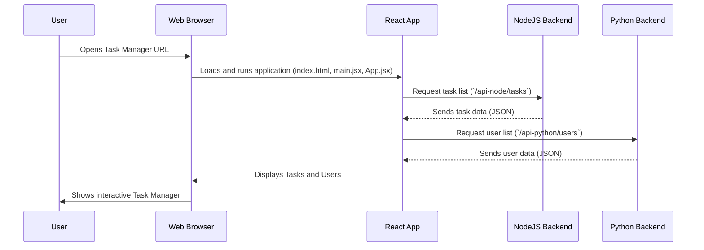

# Chapter 1: React Frontend Application

Imagine you're driving a car. What you see and touch – the steering wheel, speedometer, radio, and dashboard – that's the "frontend." It's your control panel, allowing you to interact with the powerful engine and complex systems hidden beneath the hood.

In our **AppDocker** project, the **React Frontend Application** plays a similar role. It's the "control panel" that you, the user, will see and interact with in your web browser. This chapter will introduce you to this crucial part of our application.

### What Problem Does the React Frontend Solve?

Our goal is to build a `Task Manager` application. Users need to be able to:
*   See a list of tasks.
*   Add new tasks.
*   Edit existing tasks.
*   Delete tasks.
*   View and manage users.
*   See a dashboard with overall statistics (like how many tasks are pending).

The React Frontend is specifically designed to handle all these interactions. It's responsible for presenting information clearly and responding instantly to your clicks and typing. Without a frontend, you'd be looking at raw data or sending complex commands directly to a server, which isn't very user-friendly!

### What is a Frontend?

The "frontend" refers to the part of a software application that users directly interact with. It's everything you see on a website or app – the buttons, text, images, forms, and animations. It runs directly in your web browser (like Chrome, Firefox, or Edge) and is built using web technologies like HTML (for structure), CSS (for styling), and JavaScript (for interactivity).

### What is ReactJS?

ReactJS (often just called React) is a popular JavaScript library specifically designed for building user interfaces. Think of it as a specialized toolkit for creating interactive "control panels" for your web applications.

Here's why React is so widely used and helpful for beginners:

1.  **Component-Based**: React encourages you to break down your user interface into small, reusable pieces called "components."
    *   Imagine building a house with LEGO bricks. Each brick (a wall section, a window, a door) is a component. You can assemble them in different ways to create a complete house.
    *   In our `Task Manager`, you might have a `TaskList` component, a `UserList` component, and even smaller components like a `TaskItem` or `UserItem`. This makes your code organized and easy to manage.

2.  **Declarative**: You tell React *what* you want the interface to look like for a given state, and React figures out *how* to update the actual web page efficiently.
    *   Instead of saying "find this button, change its color to blue," you say "when the task is 'done', show the button in blue." React handles the mechanics.

3.  **Efficient Updates**: When data changes (e.g., you mark a task as "done"), React smartly updates only the necessary parts of the page, making your application feel fast and smooth.

### The React Frontend in Our AppDocker Project

In our project, the React Frontend is not just showing static information. It's constantly talking to different "backend" services (which we'll explore in upcoming chapters).

*   It sends requests to a [NodeJS Tasks API](02_nodejs_tasks_api_.md) to get, add, update, or delete tasks.
*   It sends requests to a [Python Users & Dashboard API](03_python_users___dashboard_api_.md) to manage users and fetch analytics data for the dashboard.

This communication happens behind the scenes, providing you with a seamless experience.

### Setting Up Our React Frontend

Let's get a basic React application running. We'll use a tool called **Vite**, which helps create React projects quickly and efficiently.

1.  **Create the Project Folder**:
    Open your terminal (e.g., in VS Code) and create a new React project inside a folder named `frontend`.

    ```bash
    npm create vite@latest frontend -- --template react
    ```
    This command tells `npm` (Node Package Manager) to use Vite to create a new React project in a folder called `frontend`.

2.  **Navigate into the Project**:
    Move into your newly created `frontend` directory.

    ```bash
    cd frontend
    ```

3.  **Install Dependencies**:
    React projects rely on many smaller code packages (dependencies). Install them using `npm`.

    ```bash
    npm install
    ```
    This command reads the `package.json` file in your `frontend` folder and downloads all the necessary libraries.

4.  **Run the Development Server**:
    Now, let's see your React app in action!

    ```bash
    npm run dev
    ```
    You'll see a message like `http://localhost:5173`. Open this URL in your web browser. You should see the default React welcome page. This "development server" automatically reloads your page whenever you make changes to the code.

5.  **Make it Talk to a Mock Backend**:
    Our React app needs to fetch data. For now, we'll make it talk to a "mock" (fake) backend that we'll set up quickly in a later chapter. The idea is to understand the *frontend's* role in requesting and displaying data.

    Let's modify the main application file, `src/App.jsx`, to fetch some data. For this example, we'll pretend there's a [NodeJS Tasks API](02_nodejs_tasks_api_.md) running at `http://localhost:3000/api-node/tasks` that gives us a list of tasks.

    ```jsx
    import { useState, useEffect } from 'react'; // 1. Import necessary tools

    function App() {
      const [tasks, setTasks] = useState([]); // 2. Create a place to store tasks

      useEffect(() => { // 3. Do something when the app starts
        fetch('http://localhost:3000/api-node/tasks') // 4. Ask the backend for tasks
          .then(response => response.json()) // 5. Convert the response to data
          .then(data => setTasks(data)) // 6. Put the data into our tasks list
          .catch(error => console.error("Error fetching tasks:", error)); // 7. Handle errors
      }, []); // This empty array means 'run once when the component appears'

      return ( // 8. What the user sees
        <div style={{ padding: '20px' }}>
          <h1>My Tasks</h1>
          <ul>
            {tasks.map(task => ( // 9. Show each task in a list
              <li key={task.id}>{task.title}</li>
            ))}
          </ul>
        </div>
      );
    }

    export default App; // Make our App available
    ```
    **Explanation:**
    *   **Line 1**: We import `useState` to manage data that changes (like our list of tasks) and `useEffect` to perform actions when the component "mounts" (appears on screen).
    *   **Line 2**: `useState([])` initializes an empty list `tasks` and gives us a function `setTasks` to update it.
    *   **Line 3**: `useEffect` is like a componentDidMount hook, it runs code after the component is first rendered.
    *   **Line 4-7**: This is the core part! The `fetch` command sends a request to our (imaginary for now) backend. Once it gets a response, it converts it to JSON and updates our `tasks` list.
    *   **Line 8-10**: This is the HTML-like code (called JSX) that React renders. It displays a heading and then loops through our `tasks` list to show each task as a list item.

    If you run `npm run dev` after saving `App.jsx`, you won't see tasks yet because `http://localhost:3000` isn't running. But this code shows how the frontend *prepares* to talk to the backend.

### How It Works: Under the Hood

Let's trace what happens when you open the `Task Manager` in your browser.

#### User Experience Flow

1.  **You type the URL**: You open your web browser and type in the address (e.g., `http://localhost:5173` for development).
2.  **Browser loads the page**: Your browser sends a request to the development server (started by `npm run dev`), which sends back the basic `index.html` file.
3.  **React takes over**: The `index.html` file tells the browser to load our React application (which is written in JavaScript).
4.  **React asks for data**: As soon as the React application starts, it immediately sends requests to our backend services (e.g., the [NodeJS Tasks API](02_nodejs_tasks_api_.md) for tasks and the [Python Users & Dashboard API](03_python_users___dashboard_api_.md) for users and dashboard data).
5.  **Backend responds**: The backend services process these requests (e.g., fetching data from a database) and send the requested information back to the React app.
6.  **React displays data**: The React app receives the data and updates the user interface to show the tasks, users, and dashboard analytics.
7.  **You interact**: Now you can click buttons, type in forms, and the React app will handle those interactions, sending new requests to the backend when needed (e.g., to add a new task).

#### Simplified Sequence Diagram

Here's a visual representation of the core interaction:



#### Key Code Parts Explained

Let's look at the actual files that make this happen in your `frontend` folder:

1.  **`frontend/index.html`**:
    This is the very first file your browser loads. It's a standard HTML file but notice the `<div id="root"></div>`. This is where our React application will "attach" itself and render all its content.

    ```html
    <!doctype html>
    <html lang="en">
      <head>
        <meta charset="UTF-8" />
        <meta name="viewport" content="width=device-width, initial-scale=1.0" />
        <title>Task Manager - Lab 7</title>
      </head>
      <body>
        <div id="root"></div> <!-- React app will live here -->
        <script type="module" src="/src/main.jsx"></script> <!-- This loads our React code -->
      </body>
    </html>
    ```
    **Explanation**: The key part is the `<script>` tag. It loads `main.jsx`, which is the entry point for our React application.

2.  **`frontend/src/main.jsx`**:
    This file is responsible for "bootstrapping" (starting up) your React application. It tells React *what* component to render (`App`) and *where* to render it (inside the `root` div from `index.html`).

    ```jsx
    import React from 'react'
    import ReactDOM from 'react-dom/client'
    import App from './App.jsx' // Import our main App component

    ReactDOM.createRoot(document.getElementById('root')).render(
      <React.StrictMode>
        <App /> {/* Render our App component */}
      </React.StrictMode>,
    )
    ```
    **Explanation**: `ReactDOM.createRoot` is the modern way to tell React to take control of a specific part of your HTML page. In this case, it finds the `div` with `id="root"` and then renders our `App` component inside it.

3.  **`frontend/src/App.jsx`**:
    This is the main component of our application. As seen before, it uses **state** to hold data (like `tasks` or `users`) and **effects** (`useEffect`) to fetch data from our backend APIs when the component first loads. It also renders different sub-components (`TaskList`, `UserList`, `Dashboard`) based on which tab is active.

    ```jsx
    import { useState } from 'react';
    import TaskList from './components/TaskList';       // Component for Tasks
    import UserList from './components/UserList';       // Component for Users
    import Dashboard from './components/Dashboard';     // Component for Dashboard

    function App() {
      const [activeTab, setActiveTab] = useState('dashboard'); // Manage which tab is active

      // Styling for tabs (simplified)
      const tabStyle = (tab) => ({
        padding: '10px 24px',
        cursor: 'pointer',
        borderBottom: activeTab === tab ? '3px solid #2196F3' : '3px solid transparent',
        fontWeight: activeTab === tab ? 'bold' : 'normal',
      });

      return (
        <div style={{ fontFamily: 'Arial, sans-serif' }}>
          <h1>Task Manager - Microservices</h1>
          <p>NodeJS API → Tasks &nbsp;|&nbsp; Python API → Users & Dashboard</p>

          <div style={{ display: 'flex' }}> {/* Tab navigation */}
            <button style={tabStyle('dashboard')} onClick={() => setActiveTab('dashboard')}>📊 Dashboard</button>
            <button style={tabStyle('tasks')} onClick={() => setActiveTab('tasks')}>📝 Tasks (NodeJS)</button>
            <button style={tabStyle('users')} onClick={() => setActiveTab('users')}>👥 Users (Python)</button>
          </div>

          {activeTab === 'dashboard' && <Dashboard />} {/* Show Dashboard component if active */}
          {activeTab === 'tasks' && <TaskList />}       {/* Show TaskList component if active */}
          {activeTab === 'users' && <UserList />}       {/* Show UserList component if active */}
        </div>
      );
    }

    export default App;
    ```
    **Explanation**:
    *   It imports `TaskList`, `UserList`, and `Dashboard` components. These are smaller, specialized React components that handle specific parts of the UI (e.g., showing only tasks, or only users).
    *   `useState('dashboard')` manages which tab (Dashboard, Tasks, or Users) is currently selected.
    *   Based on `activeTab`, it conditionally renders the corresponding component (`<Dashboard />`, `<TaskList />`, or `<UserList />`). This is how React builds dynamic interfaces.

### Conclusion

In this chapter, we explored the **React Frontend Application**, the "face" of our **AppDocker** project. You learned that it's the part users see and interact with, built using ReactJS components to create a dynamic and responsive user interface. We saw how it acts as a control panel, making requests to different backend services to manage tasks, users, and display analytics.

In the next chapter, we'll dive into one of these backend services: the [NodeJS Tasks API](02_nodejs_tasks_api_.md). This is where the "engine" for managing our tasks truly resides, responding to the requests from our shiny new React frontend.

[Next Chapter: NodeJS Tasks API](02_nodejs_tasks_api_.md)

---

<sub><sup>Generated by [AI Codebase Knowledge Builder](https://github.com/The-Pocket/Tutorial-Codebase-Knowledge).</sup></sub> <sub><sup>**References**: [[1]](https://github.com/gianglt-dau/AppDocker/blob/42380997d078588130a5c047568a8b9cc06fb0c5/Lab7/frontend/.dockerignore), [[2]](https://github.com/gianglt-dau/AppDocker/blob/42380997d078588130a5c047568a8b9cc06fb0c5/Lab7/frontend/Dockerfile), [[3]](https://github.com/gianglt-dau/AppDocker/blob/42380997d078588130a5c047568a8b9cc06fb0c5/Lab7/frontend/index.html), [[4]](https://github.com/gianglt-dau/AppDocker/blob/42380997d078588130a5c047568a8b9cc06fb0c5/Lab7/frontend/package.json), [[5]](https://github.com/gianglt-dau/AppDocker/blob/42380997d078588130a5c047568a8b9cc06fb0c5/Lab7/frontend/src/App.jsx), [[6]](https://github.com/gianglt-dau/AppDocker/blob/42380997d078588130a5c047568a8b9cc06fb0c5/Lab7/frontend/src/components/Dashboard.jsx), [[7]](https://github.com/gianglt-dau/AppDocker/blob/42380997d078588130a5c047568a8b9cc06fb0c5/Lab7/frontend/src/components/TaskList.jsx), [[8]](https://github.com/gianglt-dau/AppDocker/blob/42380997d078588130a5c047568a8b9cc06fb0c5/Lab7/frontend/src/components/UserList.jsx), [[9]](https://github.com/gianglt-dau/AppDocker/blob/42380997d078588130a5c047568a8b9cc06fb0c5/Lab7/frontend/src/main.jsx), [[10]](https://github.com/gianglt-dau/AppDocker/blob/42380997d078588130a5c047568a8b9cc06fb0c5/Lab7/frontend/vite.config.js), [[11]](https://github.com/gianglt-dau/AppDocker/blob/42380997d078588130a5c047568a8b9cc06fb0c5/Notes.md)</sup></sub>