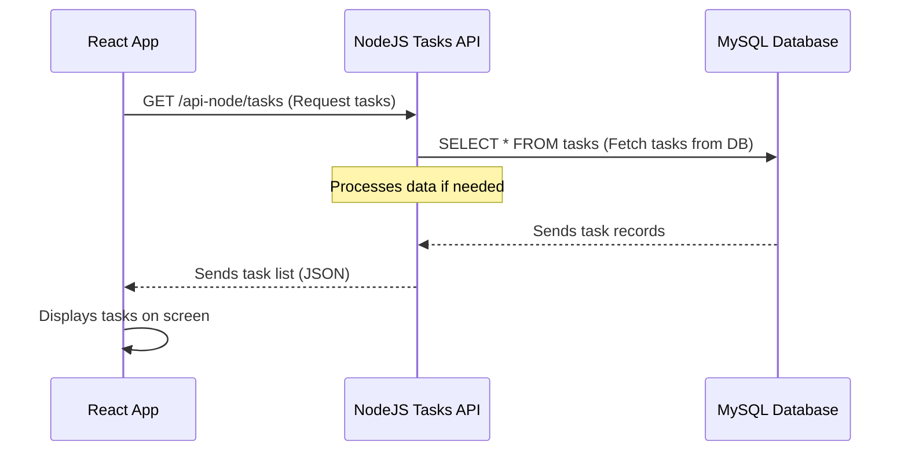

# Chapter 2: NodeJS Tasks API

In [Chapter 1: React Frontend Application](01_react_frontend_application_.md), we explored the "face" of our **AppDocker** project – the part you see and interact with in your browser. We learned that the React app acts like a sophisticated control panel, allowing you to view, add, edit, and delete tasks.

But a control panel needs something powerful working behind the scenes. Just like a car's dashboard controls a complex engine, our React frontend needs specialized services to handle the actual "work." This chapter introduces one of those crucial backend services: the **NodeJS Tasks API**.

### What Problem Does the NodeJS Tasks API Solve?

Imagine you're using a task manager app. When you click "Add New Task," where does that task information go? When you open the app, how does it know which tasks to show you?

The **NodeJS Tasks API** is the dedicated "employee" in our application whose *only* job is to manage tasks.

*   **You want to add a new task?** The React frontend sends a request to the NodeJS Tasks API. The API then carefully saves your new task.
*   **You want to see all your tasks?** The React frontend asks the NodeJS Tasks API. The API fetches all your tasks and sends them back.
*   **You finished a task?** The React frontend tells the NodeJS Tasks API, and the API updates that task's status.
*   **You no longer need a task?** The React frontend instructs the NodeJS Tasks API to delete it.

In short, this API handles all interactions related to tasks, making sure they are created, retrieved, updated, and deleted correctly. Without it, your React frontend would have no way to persistently store or manage your task list.

### Key Concepts

Let's break down the important ideas behind this "Task Manager" employee:

#### 1. Node.js: JavaScript for Servers

You might know JavaScript as the language that makes websites interactive in your browser. **Node.js** is a special "engine" that allows you to run JavaScript *outside* of a web browser, typically on a server.

*   **Analogy**: Think of JavaScript as a skilled chef. Normally, this chef cooks only in a home kitchen (the browser). Node.js is like giving that chef a fully equipped restaurant kitchen (a server) where they can prepare bigger, more complex meals (backend services) for many customers at once.

Using Node.js means we can use the same language (JavaScript) for both our frontend (React) and our backend (NodeJS Tasks API), which can make development smoother.

#### 2. Express.js: Building Web APIs Easily

Building a backend server from scratch can be a lot of work. That's where **Express.js** comes in. It's a popular "framework" for Node.js that provides tools and structures to make building web APIs much simpler and faster.

*   **Analogy**: If Node.js gives our chef a restaurant kitchen, Express.js provides all the specialized equipment, recipes, and streamlined processes to make cooking efficient. It helps define *how* the API should respond to different requests.

#### 3. API (Application Programming Interface): The Communication Rules

An **API** is essentially a set of rules and specifications that allows different software applications to talk to each other. In our case, it's how our React frontend talks to our NodeJS backend.

*   **Analogy**: An API is like a menu in a restaurant. You don't go into the kitchen to cook your food; you tell the waiter (the API endpoint) what you want from the menu (the API request), and the kitchen (the backend service) prepares it and sends it back to you.

When the React frontend wants tasks, it makes an API *request* (like ordering from the menu). The NodeJS Tasks API then processes that request and sends back an API *response* (like delivering your food).

#### 4. CRUD Operations: The Task Manager's Toolkit

CRUD is a fundamental concept in software development, especially for applications that manage data. It stands for the four basic functions:

| Operation | Description                                             | Task Manager Example                                         |
| :-------- | :------------------------------------------------------ | :----------------------------------------------------------- |
| **C**reate  | Adding new data.                                        | Creating a new task like "Buy groceries".                    |
| **R**ead    | Retrieving (getting) existing data.                   | Getting a list of all your tasks, or details for one specific task. |
| **U**pdate  | Modifying existing data.                                | Changing a task's title from "Buy groceries" to "Buy milk and bread", or marking it as "completed". |
| **D**elete  | Removing existing data.                                 | Deleting a task you no longer need.                          |

The NodeJS Tasks API is specifically designed to perform these CRUD operations on our "tasks."

### How Our React Frontend Interacts with the NodeJS Tasks API

Let's revisit the `App.jsx` from [Chapter 1: React Frontend Application](01_react_frontend_application_.md). Remember this part?

```jsx
// ... (imports and useState)

useEffect(() => { // 3. Do something when the app starts
  fetch('http://localhost:3000/api-node/tasks') // 4. Ask the backend for tasks
    .then(response => response.json()) // 5. Convert the response to data
    .then(data => setTasks(data)) // 6. Put the data into our tasks list
    .catch(error => console.error("Error fetching tasks:", error)); // 7. Handle errors
}, []); // This empty array means 'run once when the component appears'

// ... (return statement)
```

**Explanation:**
-   **`fetch('http://localhost:3000/api-node/tasks')`**: This is the React frontend (the browser) making a **"Read" (GET)** request to the NodeJS Tasks API. It's asking, "Hey API, give me all the tasks!"
    -   `http://localhost:3000` is the address where our NodeJS API will be running.
    -   `/api-node/tasks` is the specific "menu item" (API endpoint) for getting tasks.
-   **`.then(response => response.json())`**: The API sends back data, typically in a format called JSON (JavaScript Object Notation), which is like a standardized way to package information. This line converts that package into something our JavaScript code can easily use.
-   **`.then(data => setTasks(data))`**: Once the data is ready, our React app updates its `tasks` list using the `setTasks` function, which then automatically updates what you see on the screen.

This example shows the "Read" part of CRUD. The API also has endpoints for Create, Update, and Delete, which the frontend would call when you click buttons like "Add Task," "Edit," or "Delete."

### Under the Hood: The API's Workflow

Let's trace a typical interaction when our React app wants to get the list of tasks from the NodeJS API.



**Step-by-Step Explanation:**

1.  **React App asks for tasks**: When your Task Manager loads in the browser, the React frontend sends a `GET` request to the NodeJS Tasks API at `/api-node/tasks`.
2.  **NodeJS Tasks API receives request**: The NodeJS API server, running on a server, receives this request. It knows (because we programmed it) that this particular request means "get all tasks."
3.  **NodeJS Tasks API talks to the Database**: To get the actual task data, the NodeJS API then sends a query (a command) to our [MySQL Database](04_mysql_database_.md), asking for all the entries in the `tasks` table.
4.  **MySQL Database sends tasks back**: The database processes the query, finds all the task records, and sends them back to the NodeJS Tasks API.
5.  **NodeJS Tasks API sends tasks to React App**: The API receives the raw task data from the database, formats it nicely into JSON, and sends this JSON data back as a response to the waiting React frontend.
6.  **React App displays tasks**: The React app receives the JSON data, updates its internal list of tasks, and renders them onto your web page for you to see!

### Core Files and Their Role

Let's look at the actual files that make this NodeJS Tasks API work in our `node-api` folder.

#### 1. `node-api/package.json`

This file is like the "ID card" for our Node.js project. It contains important information about the project, like its name, version, and most importantly, a list of all the **dependencies** (other code packages) it needs to run, such as `express` and `mysql2`.

```json
{
  "name": "node-api-tasks",
  "version": "1.0.0",
  "description": "Lab7 - NodeJS API quản lý Tasks (CRUD)",
  "main": "app.js",
  "scripts": {
    "start": "node app.js"
  },
  "dependencies": {
    "express": "^4.18.2",
    "cors": "^2.8.5",
    "mysql2": "^3.6.5"
  }
}
```
**Explanation:**
-   `dependencies`: Lists the libraries our API needs. `express` for building the web server, `cors` for allowing our frontend to talk to it, and `mysql2` for connecting to the [MySQL Database](04_mysql_database_.md).
-   `scripts`: Defines commands like `npm start` to run our application.

#### 2. `node-api/app.js`

This is the heart of our NodeJS Tasks API. It's where we set up the Express server, define all the API endpoints (the "menu items" for tasks), and write the logic for each CRUD operation.

Let's look at simplified snippets.

First, setting up Express and connecting to the database:

```javascript
const express = require('express'); // 1. Import Express
const cors = require('cors');       // 2. Import CORS for cross-origin requests
const mysql = require('mysql2/promise'); // 3. Import MySQL client
const app = express();              // 4. Create an Express application

app.use(cors());                    // 5. Enable CORS for all routes
app.use(express.json());            // 6. Enable parsing JSON in request bodies

// 7. Database connection setup (more details in Chapter 4)
let db;
async function connectDB() {
    // This part attempts to connect to MySQL.
    // In a Docker environment, the DB_HOST will be the name of the MySQL service.
    // For local development, it might be "127.0.0.1".
    db = await mysql.createConnection({
        host: process.env.DB_HOST || "127.0.0.1",
        user: "root",
        password: "root",
        database: "appdb"
    });
    console.log("✅ MySQL Connected!");
}

// ... more API endpoints defined here ...

// Start the server after connecting to the DB
connectDB().then(() => {
    app.listen(3000, () => console.log("🚀 NodeJS Tasks API running on port 3000"));
});
```
**Explanation:**
-   **Lines 1-4**: We bring in the necessary libraries (`express`, `cors`, `mysql2`) and create our Express app.
-   **Lines 5-6**: `app.use(cors())` allows our React frontend (which runs on a different address/port) to communicate with this API. `app.use(express.json())` helps our API understand data sent in JSON format.
-   **Line 7 (and `connectDB` function)**: This is how our API prepares to talk to the [MySQL Database](04_mysql_database_.md). It sets up a connection. We'll learn more about the database in a later chapter.
-   **`app.listen(3000)`**: This line starts our API server, making it listen for incoming requests on port 3000.

Next, a simple **"Read" (GET)** endpoint to get all tasks:

```javascript
// GET - Lấy tất cả tasks
app.get('/api-node/tasks', async (req, res) => {
    try {
        const [rows] = await db.query("SELECT * FROM tasks ORDER BY id DESC"); // 1. Query the database
        res.json(rows); // 2. Send the tasks back as JSON
    } catch (err) {
        res.status(500).json({ error: err.message }); // 3. Handle errors
    }
});
```
**Explanation:**
-   **`app.get('/api-node/tasks', ...)`**: This tells Express: "When a `GET` request comes to the `/api-node/tasks` address, run this function."
-   **Line 1**: `db.query("SELECT * FROM tasks")` is the command sent to the database to fetch all tasks. The `await` keyword means the API will pause here until the database sends back the result.
-   **Line 2**: `res.json(rows)` takes the tasks received from the database and sends them back to the React frontend in JSON format.
-   **Line 3**: The `try...catch` block helps us gracefully handle any errors that might occur, for example, if the database is not available.

There would be similar `app.post`, `app.put`, and `app.delete` routes for the other CRUD operations, each handling saving, updating, or deleting tasks by sending different commands to the [MySQL Database](04_mysql_database_.md).

### Conclusion

In this chapter, we unpacked the **NodeJS Tasks API**, our dedicated backend service for managing tasks. You learned that it's built with Node.js and Express.js, providing a robust way to perform CRUD (Create, Read, Update, Delete) operations on tasks. This API is the silent worker behind the scenes, processing requests from our React frontend and interacting with the database to keep your task data organized and safe.

Now that we understand how tasks are managed, we'll look at another specialized backend service in the next chapter.

[Next Chapter: Python Users & Dashboard API](03_python_users___dashboard_api_.md)

---

<sub><sup>Generated by [AI Codebase Knowledge Builder](https://github.com/The-Pocket/Tutorial-Codebase-Knowledge).</sup></sub> <sub><sup>**References**: [[1]](https://github.com/gianglt-dau/AppDocker/blob/42380997d078588130a5c047568a8b9cc06fb0c5/Lab7/node-api/.dockerignore), [[2]](https://github.com/gianglt-dau/AppDocker/blob/42380997d078588130a5c047568a8b9cc06fb0c5/Lab7/node-api/Dockerfile), [[3]](https://github.com/gianglt-dau/AppDocker/blob/42380997d078588130a5c047568a8b9cc06fb0c5/Lab7/node-api/app.js), [[4]](https://github.com/gianglt-dau/AppDocker/blob/42380997d078588130a5c047568a8b9cc06fb0c5/Lab7/node-api/package.json), [[5]](https://github.com/gianglt-dau/AppDocker/blob/42380997d078588130a5c047568a8b9cc06fb0c5/Notes.md)</sup></sub>