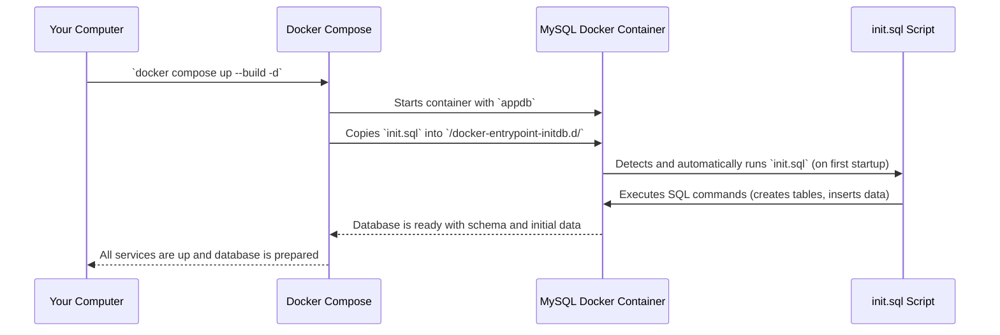

# Chapter 5: Database Schema & Seeding

In [Chapter 4: MySQL Database](04_mysql_database_.md), we introduced the **MySQL Database** as the central storage unit for our **AppDocker** project. We learned that it's where all our tasks, user details, and other important information live persistently.

Now, imagine you've just bought a brand new, empty filing cabinet. Before you can start putting important documents inside, what do you need to do? You need to:
1.  **Set up the structure**: Decide how many drawers it will have, what each drawer will be for (e.g., "Users," "Tasks"), and what kind of labels or sections will be inside each drawer (e.g., "Name," "Email," "Task Title," "Status"). This is like defining the "template" for your filing system.
2.  **Put in some initial documents**: Maybe some blank forms, an instruction manual, or a few sample documents to show how the system works. This makes the cabinet ready for use right away.

This chapter is all about these two crucial steps for our database: defining its structure (the **Database Schema**) and populating it with initial, useful data (the **Database Seeding**).

### What Problem Do Database Schema & Seeding Solve?

Our **AppDocker** application needs to store information about `users` and `tasks`.
*   How does the database know what kind of information to expect for a user (a name, an email, a role)?
*   How does it know that a task might be "assigned to" a specific user?
*   What happens when our application first starts? Will it be completely empty?

**Database Schema** solves the first two problems: it defines the exact blueprint for how all our data should be organized. It sets the rules for what tables exist, what columns are in each table, what type of data goes into each column (text, numbers, dates), and how different tables are linked.

**Database Seeding** solves the third problem: it provides initial, useful data. This ensures that when our application (or anyone else using it) starts up for the very first time, it's not completely blank. There will be some sample users and tasks ready to go, making the application immediately functional and easier to test.

Together, they ensure our application has a ready-to-use, well-organized database without needing any manual setup after deployment.

### Key Concepts

Let's break down these two fundamental concepts:

#### 1. Database Schema: The Blueprint

The **Database Schema** is essentially the architectural blueprint of your database. It defines the structure and rules of all the data you plan to store.

*   **Analogy**: Think of it as the detailed floor plan for our digital filing cabinet. It tells us:
    *   We have a "Users" drawer and a "Tasks" drawer.
    *   The "Users" drawer has slots for `ID`, `Name`, `Email`, and `Role`.
    *   The "Tasks" drawer has slots for `ID`, `Title`, `Status`, and a special slot for `Assigned To` which must refer to an `ID` in the "Users" drawer.
    *   It also dictates rules, like "an ID must be a number" or "a Name cannot be empty."

*   **What it includes**:
    *   **Tables**: The main categories of information (e.g., `users`, `tasks`).
    *   **Columns**: Specific pieces of information within each table (e.g., `name`, `email` in the `users` table).
    *   **Data Types**: What kind of data each column holds (e.g., `INT` for numbers, `VARCHAR` for text).
    *   **Constraints**: Rules like `PRIMARY KEY` (a unique ID for each record), `NOT NULL` (a column must have a value), `DEFAULT` (a default value if none is provided), and most importantly, `FOREIGN KEY` (links between tables).

#### 2. Database Seeding: The Starter Data

**Database Seeding** is the process of populating your database with an initial set of data. This data can be:

*   **Sample data**: Fictional users and tasks for testing and demonstration.
*   **Default configuration**: Essential settings the application needs to start.
*   **Master data**: Fixed lists of options, like different `roles` a user can have.

*   **Analogy**: After setting up the "Users" and "Tasks" drawers in our filing cabinet according to the blueprint, we put in a few sample "User" files (e.g., "Nguyễn Văn A," "Trần Thị B") and some sample "Task" files (e.g., "Design Dashboard," "Write User API") right away. This way, when we open the cabinet, it's not completely empty.

*   **Why it's important**:
    *   **Immediate Usability**: The application works right after deployment without manual data entry.
    *   **Development & Testing**: Developers have consistent data to work with.
    *   **Demonstration**: Easy to show off features with pre-filled data.

### How We Use Schema & Seeding in AppDocker

In our **AppDocker** project, we combine both the schema definition and the seeding process into a single SQL script called `init.sql`. This script is designed to run automatically when our [MySQL Database](04_mysql_database_.md) Docker container starts up for the very first time.

This means that every time we deploy our application, the database is automatically set up with the correct structure and filled with useful sample data!

### Under the Hood: The `init.sql` File

Let's look at our `init.sql` file. This is the script that defines our database's blueprint and then adds the initial sample documents. You can find this file at `Lab7/init.sql` in your project folder.

#### 1. Defining the `users` table (Schema)

First, we tell MySQL to create a table called `users`.

```sql
-- ==================== BẢNG USERS ====================
CREATE TABLE IF NOT EXISTS users (
    id INT AUTO_INCREMENT PRIMARY KEY,
    name VARCHAR(255) NOT NULL,
    email VARCHAR(255) NOT NULL,
    role VARCHAR(50) DEFAULT 'member'
);
```
**Explanation:**
*   **`CREATE TABLE IF NOT EXISTS users`**: This command creates a new table named `users`. `IF NOT EXISTS` is a safety net – it only creates the table if one doesn't already exist, preventing errors if you run the script multiple times.
*   **`id INT AUTO_INCREMENT PRIMARY KEY`**: This defines a column named `id`. It's an `INT` (integer/whole number), `AUTO_INCREMENT` (MySQL automatically gives it a new, unique number each time a new user is added), and `PRIMARY KEY` (it's the main, unique identifier for each user).
*   **`name VARCHAR(255) NOT NULL`**: This defines the `name` column. It's `VARCHAR(255)` (text up to 255 characters long) and `NOT NULL` (meaning a user *must* have a name; it cannot be empty).
*   **`email VARCHAR(255) NOT NULL`**: Similar to `name`, this is for the user's email, which also cannot be empty.
*   **`role VARCHAR(50) DEFAULT 'member'`**: This defines the `role` column (e.g., 'admin', 'manager', 'member'). If no role is specified when adding a user, it will automatically default to `'member'`.

#### 2. Defining the `tasks` table and its relationship (Schema)

Next, we define our `tasks` table. Notice how it links back to the `users` table.

```sql
-- ==================== BẢNG TASKS ====================
CREATE TABLE IF NOT EXISTS tasks (
    id INT AUTO_INCREMENT PRIMARY KEY,
    title VARCHAR(255) NOT NULL,
    status VARCHAR(50) DEFAULT 'pending',
    assigned_to INT,
    FOREIGN KEY (assigned_to) REFERENCES users(id) ON DELETE SET NULL
);
```
**Explanation:**
*   **`CREATE TABLE IF NOT EXISTS tasks`**: Creates a new table named `tasks`.
*   **`id INT AUTO_INCREMENT PRIMARY KEY`**: Similar to the `users` table, a unique ID for each task.
*   **`title VARCHAR(255) NOT NULL`**: The description of the task, cannot be empty.
*   **`status VARCHAR(50) DEFAULT 'pending'`**: The current status of the task (e.g., 'pending', 'in_progress', 'done'). Defaults to 'pending'.
*   **`assigned_to INT`**: This column will hold the `id` of the user who is assigned this task. It's an `INT` because it refers to the `id` from the `users` table.
*   **`FOREIGN KEY (assigned_to) REFERENCES users(id) ON DELETE SET NULL`**: This is the crucial part that creates a **relationship**!
    *   It declares that the `assigned_to` column in *this* `tasks` table is a `FOREIGN KEY`.
    *   It `REFERENCES` the `id` column in the `users` table. This means any value in `assigned_to` *must* correspond to an `id` that actually exists in the `users` table.
    *   `ON DELETE SET NULL`: This is a rule. If a user is deleted from the `users` table, any tasks previously `assigned_to` that user will *not* be deleted. Instead, their `assigned_to` field will simply be set to `NULL` (empty), meaning the task is no longer assigned to anyone.

#### 3. Inserting Sample Users (Seeding)

After defining the `users` table, we add some initial user data:

```sql
-- ==================== DỮ LIỆU MẪU ====================

-- Users
INSERT INTO users (name, email, role) VALUES
('Nguyễn Văn A', 'nguyenvana@email.com', 'admin'),
('Trần Thị B', 'tranthib@email.com', 'manager'),
('Lê Văn C', 'levanc@email.com', 'member'),
('Phạm Thị D', 'phamthid@email.com', 'member'),
('Hoàng Văn E', 'hoangvane@email.com', 'member');
```
**Explanation:**
*   **`INSERT INTO users (name, email, role) VALUES (...)`**: This command adds new rows (records) into the `users` table. We specify the columns we are providing values for (`name`, `email`, `role`) and then list the actual `VALUES` for each user. MySQL will automatically generate an `id` for each new user because of `AUTO_INCREMENT`.

#### 4. Inserting Sample Tasks (Seeding)

Finally, we add some initial task data, making sure to assign them to our sample users:

```sql
-- Tasks (gán cho users)
INSERT INTO tasks (title, status, assigned_to) VALUES
('Thiết kế giao diện Dashboard', 'done', 1),
('Viết API quản lý Users', 'done', 2),
('Tích hợp Database MySQL', 'in_progress', 1),
('Viết Dockerfile cho Backend', 'in_progress', 3),
('Deploy lên Docker Hub', 'pending', 2),
('Viết tài liệu hướng dẫn', 'pending', 4),
('Test API endpoints', 'in_progress', 5),
('Cấu hình Nginx reverse proxy', 'done', 3);
```
**Explanation:**
*   **`INSERT INTO tasks (title, status, assigned_to) VALUES (...)`**: This command adds new tasks. Notice how the `assigned_to` value (e.g., `1`, `2`, `3`) corresponds to the `id` of the sample users we just created. For example, a task with `assigned_to = 1` means it's assigned to 'Nguyễn Văn A' (who has `id = 1`).

### How `init.sql` is Executed

The magic that makes this `init.sql` script run automatically comes from our `docker-compose.yml` file, specifically the `mysql` service definition.

```yaml
  mysql:
    image: mysql:8
    environment:
      MYSQL_ROOT_PASSWORD: root
      MYSQL_DATABASE: appdb
    volumes:
      - mysql_data:/var/lib/mysql
      - ./init.sql:/docker-entrypoint-initdb.d/init.sql # <--- THIS LINE!
    healthcheck:
      test: ["CMD", "mysqladmin", "ping", "-h", "localhost"]
      interval: 5s
      timeout: 5s
      retries: 10
```
**Explanation:**
The line `- ./init.sql:/docker-entrypoint-initdb.d/init.sql` is key. It tells Docker to copy our local `init.sql` file into a special directory (`/docker-entrypoint-initdb.d/`) inside the MySQL container. MySQL is pre-configured to automatically run any `.sql` files found in this directory when its container starts for the very first time. This is how our database gets its schema and initial data!

#### Simplified Execution Flow



### Conclusion

In this chapter, we explored the crucial concepts of **Database Schema & Seeding**. You learned that the schema is the blueprint for our database, defining its tables, columns, and relationships (like `users` and `tasks` being linked by `assigned_to`). Seeding is the process of populating this structured database with initial sample data, ensuring our application is ready to use from the moment it starts. We saw how our `init.sql` file cleverly combines both these aspects and how `docker-compose.yml` automatically executes it when our [MySQL Database](04_mysql_database_.md) is first brought online.

Now that we understand how our individual application parts (frontend, backends, database) are designed, the next chapter will show us how to package each of them into self-contained units called **Docker Containers**.

[Next Chapter: Docker Containerization](06_docker_containerization_.md)

---

<sub><sup>Generated by [AI Codebase Knowledge Builder](https://github.com/The-Pocket/Tutorial-Codebase-Knowledge).</sup></sub> <sub><sup>**References**: [[1]](https://github.com/gianglt-dau/AppDocker/blob/42380997d078588130a5c047568a8b9cc06fb0c5/Lab3/init.sql), [[2]](https://github.com/gianglt-dau/AppDocker/blob/42380997d078588130a5c047568a8b9cc06fb0c5/Lab4/init.sql), [[3]](https://github.com/gianglt-dau/AppDocker/blob/42380997d078588130a5c047568a8b9cc06fb0c5/Lab6/init.sql), [[4]](https://github.com/gianglt-dau/AppDocker/blob/42380997d078588130a5c047568a8b9cc06fb0c5/Lab7/README.md), [[5]](https://github.com/gianglt-dau/AppDocker/blob/42380997d078588130a5c047568a8b9cc06fb0c5/Lab7/init.sql), [[6]](https://github.com/gianglt-dau/AppDocker/blob/42380997d078588130a5c047568a8b9cc06fb0c5/Notes.md)</sup></sub>