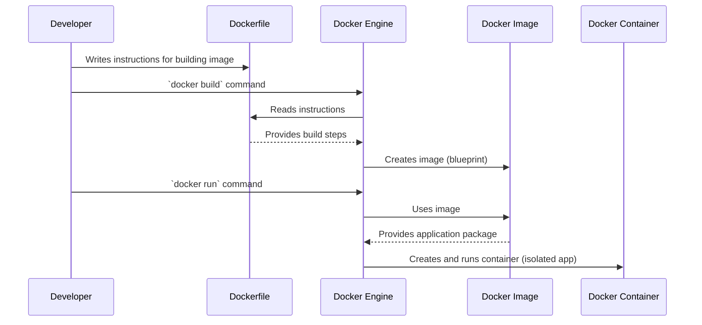

# Chapter 6: Docker Containerization

In our journey so far with **AppDocker**, we've meticulously crafted each piece of our application:
*   The interactive user interface with our [React Frontend Application](01_react_frontend_application_.md).
*   The dedicated brain for tasks, the [NodeJS Tasks API](02_nodejs_tasks_api_.md).
*   The specialized service for users and dashboard insights, the [Python Users & Dashboard API](03_python_users___dashboard_api_.md).
*   And the central storage hub, our [MySQL Database](04_mysql_database_.md), with its structure and initial data set up in [Database Schema & Seeding](05_database_schema___seeding_.md).

Each of these parts is a distinct program, written in different languages, and with its own set of requirements. But how do we ensure they all play nicely together, no matter where we run our application?

### What Problem Does Docker Containerization Solve?

Imagine you're moving into a new apartment, and you have several friends helping you, each bringing a different piece of furniture:
*   Friend A brings a TV, but it needs a specific type of power outlet and a unique stand.
*   Friend B brings a sofa, but it only fits through a certain door.
*   Friend C brings a computer, but it needs specific software pre-installed to work.

If each friend's item has its own unique, unexpected requirements, setting up your new apartment becomes a nightmare! You constantly face the "it works on my machine!" problem – it worked perfectly for them, but not in your new environment.

In the world of software, this problem is very common. Our React app needs Node.js, the Python API needs specific Python libraries, the Node.js API needs its own Node.js modules, and the MySQL database needs to run the MySQL server software. All these dependencies (things the app needs to run) can cause headaches when moving your application from your development machine to a testing environment, or to a live server.

**Docker Containerization** solves this by packaging each part of your application into isolated, self-contained units called **containers**. Imagine each container as a neatly wrapped, standardized package that includes *everything* an application needs to run: its code, its runtime (like Node.js or Python), system tools, and libraries. This ensures that each component runs consistently across different environments, making development and deployment much simpler and more reliable. No more "it works on my machine!" excuses!

### Key Concepts

Let's break down the fundamental ideas behind Docker:

#### 1. What is Docker?

**Docker** is a platform and tool that allows you to automate the deployment, scaling, and management of applications using containers. Think of it as the ultimate organizer and manager for your "standardized packages."

#### 2. What is a Container?

A **container** is an isolated, lightweight, and executable package of software that includes everything needed to run an application: code, runtime, system tools, libraries, and settings.

*   **Analogy**: Imagine a **standardized shipping container**. Inside, you can put anything – furniture, electronics, food. It doesn't matter what's inside; the *container itself* is always the same size and shape, with standard hooks and attachment points. This means it can be easily moved by any truck, ship, or crane without worrying about the specifics of its contents.
*   In our project, our React Frontend will live in one container, our NodeJS API in another, our Python API in a third, and our MySQL database in a fourth. Each is a separate "shipping container."

#### 3. What is an Image?

A **Docker Image** is a read-only template that contains the instructions for creating a container. It's like a blueprint or a recipe.

*   **Analogy**: If a container is a ready-to-use shipping container, an **image** is the detailed blueprint or manufacturing plan for that specific type of container. You use the blueprint to *create* actual shipping containers. You can have many containers (instances) created from a single image.

#### 4. What is a Dockerfile?

A **Dockerfile** is a simple text file that contains a series of instructions for Docker to build a **Docker Image**. It's the "how-to" guide for creating your application's blueprint.

*   **Analogy**: If an image is the blueprint, the **Dockerfile** is the detailed step-by-step recipe or instruction manual that tells you *how to create that blueprint*. "First, take an empty metal box. Then, add shelves here, paint it blue, put a label there..."

### How AppDocker Uses Containers

In our **AppDocker** project, we will containerize each of our application's components:

| Component                              | Role                                           | Language/Technology | Will be packaged into... |
| :------------------------------------- | :--------------------------------------------- | :------------------ | :----------------------- |
| [React Frontend](01_react_frontend_application_.md) | User Interface                                 | JavaScript (React)  | A Docker Container       |
| [NodeJS Tasks API](02_nodejs_tasks_api_.md) | Backend for Task management                    | JavaScript (Node.js)| A Docker Container       |
| [Python Users & Dashboard API](03_python_users___dashboard_api_.md) | Backend for User management & analytics        | Python (FastAPI)    | A Docker Container       |
| [MySQL Database](04_mysql_database_.md) | Persistent data storage                        | MySQL               | A Docker Container       |
| phpMyAdmin (for local management)      | Web-based tool to manage MySQL                 | PHP                 | A Docker Container       |

Each of these will run in its own isolated environment, communicating with each other through a virtual network set up by Docker. This makes our application modular, robust, and easy to deploy anywhere Docker is installed.

### Under the Hood: Building Your First Container

The process of containerizing an application starts with writing a `Dockerfile` for each component. Let's look at how we create the image for each part of our application using these instruction files.

#### Simplified Containerization Flow



Now, let's examine the `Dockerfile` for each of our custom services.

#### 1. Dockerfile for NodeJS Tasks API (`node-api/Dockerfile`)

This file tells Docker how to build an image for our [NodeJS Tasks API](02_nodejs_tasks_api_.md).

```dockerfile
FROM node:20           # Start from a Node.js 20 base image
WORKDIR /app           # Set the working directory inside the container to /app
COPY package*.json ./  # Copy package.json and package-lock.json
RUN npm install        # Install Node.js dependencies
COPY . .               # Copy the rest of our application code
EXPOSE 3000            # Announce that the app runs on port 3000
CMD ["node", "app.js"] # Command to start the application
```
**Explanation:**
*   **`FROM node:20`**: This is the foundation. It tells Docker to start with an official Node.js version 20 image, which already has Node.js and `npm` installed.
*   **`WORKDIR /app`**: All subsequent commands will be run from the `/app` directory inside the container.
*   **`COPY package*.json ./`**: We copy the `package.json` (which lists our project's dependencies) and `package-lock.json` files first.
*   **`RUN npm install`**: This command executes `npm install` inside the container, downloading all the necessary Node.js libraries. This is done early because dependencies rarely change, allowing Docker to cache this step.
*   **`COPY . .`**: This copies *all* the remaining files from our `node-api` folder into the `/app` directory inside the container.
*   **`EXPOSE 3000`**: This tells Docker that the application *inside* this container will be listening for connections on port 3000. It's like a declaration, not an actual opening of the port to your host machine.
*   **`CMD ["node", "app.js"]`**: This is the command that gets executed when a container is started from this image. It runs our `app.js` file using Node.js.

#### 2. Dockerfile for Python Users & Dashboard API (`python-api/Dockerfile`)

Here's the `Dockerfile` for our [Python Users & Dashboard API](03_python_users___dashboard_api_.md).

```dockerfile
FROM python:3.11                 # Start from a Python 3.11 base image
WORKDIR /app                     # Set the working directory to /app
COPY requirements.txt .          # Copy the list of Python dependencies
RUN pip install -r requirements.txt # Install Python libraries
COPY . .                         # Copy the rest of our application code
EXPOSE 8000                      # Announce that the app runs on port 8000
CMD ["uvicorn", "main:app", "--host", "0.0.0.0", "--port", "8000"] # Command to start the FastAPI app
```
**Explanation:**
*   **`FROM python:3.11`**: We start with an official Python 3.11 image.
*   **`WORKDIR /app`**: Sets `/app` as the working directory.
*   **`COPY requirements.txt .`**: Copies the `requirements.txt` file (which lists Python dependencies).
*   **`RUN pip install -r requirements.txt`**: Installs all required Python packages.
*   **`COPY . .`**: Copies the rest of the Python application code.
*   **`EXPOSE 8000`**: Declares that this app listens on port 8000.
*   **`CMD ["uvicorn", "main:app", "--host", "0.0.0.0", "--port", "8000"]`**: This command starts our FastAPI application using the `uvicorn` web server, making it accessible on port 8000 within its container.

#### 3. Dockerfile for React Frontend Application (`frontend/Dockerfile`)

The React frontend requires a slightly different approach because it's a client-side application that needs to be *built* (compiled) and then served by a web server (like Nginx). This often uses a "multi-stage build."

```dockerfile
FROM node:20 AS build           # Stage 1: Build the React application
WORKDIR /app
COPY . .
RUN npm install && npm run build # Install dependencies and build the app

FROM nginx:alpine               # Stage 2: Serve the built application with Nginx
COPY --from=build /app/dist /usr/share/nginx/html # Copy only the optimized build output
COPY nginx.conf /etc/nginx/conf.d/default.conf # Copy our Nginx configuration
EXPOSE 80                       # Nginx serves on port 80
```
**Explanation:**
*   **`FROM node:20 AS build`**: This starts the first stage, named `build`. We use a Node.js image to compile our React app.
*   **`RUN npm install && npm run build`**: Here, `npm install` downloads React's dependencies, and `npm run build` compiles our React source code into optimized HTML, CSS, and JavaScript files, typically placed in an `/app/dist` folder.
*   **`FROM nginx:alpine`**: This starts a *second, completely separate stage*. We use a very lightweight Nginx web server image. This image is much smaller than the Node.js image, resulting in a tiny final container.
*   **`COPY --from=build /app/dist /usr/share/nginx/html`**: This is the magic of multi-stage builds! We copy *only* the output of the `build` stage (the `/app/dist` folder containing our compiled React app) into Nginx's web root directory (`/usr/share/nginx/html`). We don't copy any Node.js development dependencies or source code, keeping the final image small and secure.
*   **`COPY nginx.conf /etc/nginx/conf.d/default.conf`**: We copy a custom `nginx.conf` file (which we'll define shortly) to configure Nginx. This file is crucial for our [Nginx Reverse Proxy](08_nginx_reverse_proxy_.md) later.
*   **`EXPOSE 80`**: Nginx, by default, serves web pages on port 80.

#### 4. MySQL Database and phpMyAdmin Containers

For common services like MySQL and phpMyAdmin, we usually don't write our own `Dockerfile`. Instead, we use pre-built, official Docker images directly from Docker Hub. These images are already optimized and maintained by the software vendors themselves. We'll see how we configure them using `docker-compose.yml` in the next chapter.

### Conclusion

In this chapter, we unlocked the power of **Docker Containerization**. You learned that containers provide an isolated, self-contained, and consistent way to package our application components, solving the "it works on my machine" problem. We explored key concepts like Docker itself, containers, images, and Dockerfiles. We then walked through the `Dockerfile` for our React frontend, Node.js API, and Python API, understanding how each instruction helps build a ready-to-run package for our application.

Now that we know how to package each individual piece of our application, the next challenge is to get them all to run together and communicate effectively. This is where **Docker Compose Orchestration** comes in, which we will explore in the next chapter.

[Next Chapter: Docker Compose Orchestration](07_docker_compose_orchestration_.md)

---

<sub><sup>Generated by [AI Codebase Knowledge Builder](https://github.com/The-Pocket/Tutorial-Codebase-Knowledge).</sup></sub> <sub><sup>**References**: [[1]](https://github.com/gianglt-dau/AppDocker/blob/42380997d078588130a5c047568a8b9cc06fb0c5/Lab6/frontend/Dockerfile), [[2]](https://github.com/gianglt-dau/AppDocker/blob/42380997d078588130a5c047568a8b9cc06fb0c5/Lab6/node-api/Dockerfile), [[3]](https://github.com/gianglt-dau/AppDocker/blob/42380997d078588130a5c047568a8b9cc06fb0c5/Lab6/python-api/Dockerfile), [[4]](https://github.com/gianglt-dau/AppDocker/blob/42380997d078588130a5c047568a8b9cc06fb0c5/Lab7/frontend/Dockerfile), [[5]](https://github.com/gianglt-dau/AppDocker/blob/42380997d078588130a5c047568a8b9cc06fb0c5/Lab7/node-api/Dockerfile), [[6]](https://github.com/gianglt-dau/AppDocker/blob/42380997d078588130a5c047568a8b9cc06fb0c5/Lab7/python-api/Dockerfile), [[7]](https://github.com/gianglt-dau/AppDocker/blob/42380997d078588130a5c047568a8b9cc06fb0c5/Notes.md)</sup></sub>