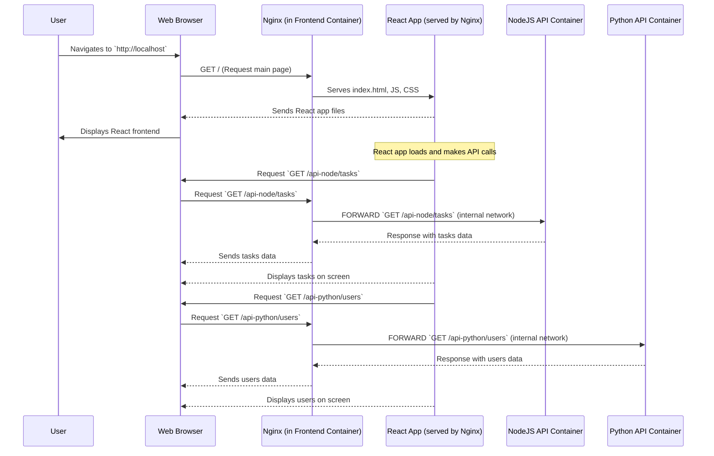

 Chapter 8: Nginx Reverse Proxy

In our exciting journey through the **AppDocker** project, we've built distinct pieces: the interactive [React Frontend Application](01_react_frontend_application_.md), the specialized [NodeJS Tasks API](02_nodejs_tasks_api_.md), the insightful [Python Users & Dashboard API](03_python_users___dashboard_api_.md), and the central [MySQL Database](04_mysql_database_.md). In [Chapter 6: Docker Containerization](06_docker_containerization_.md), we packaged each into its own container, and in [Chapter 7: Docker Compose Orchestration](07_docker_compose_orchestration_.md), we learned how to make them all run together and talk to each other within Docker's private network.

Now, a new question arises: How does the *outside world* – your web browser – access this sophisticated system? Especially when your React frontend needs to grab static files (HTML, CSS, JavaScript) from one place, but then make API calls to *two different backend services* (NodeJS and Python) at different addresses? It would be messy if your browser had to remember `http://localhost` for the frontend, `http://localhost:3000` for the Node API, and `http://localhost:8000` for the Python API, all while dealing with potential "cross-origin" issues.

### What Problem Does Nginx Reverse Proxy Solve?

Imagine your entire **AppDocker** application is a large, busy building with many different departments (our services: React, Node API, Python API). When you, as a visitor (your browser), want to enter this building, you don't want to wander around trying to find the right door for each specific request.

The **Nginx Reverse Proxy** acts as the **"smart front door" or "receptionist"** for our entire application.

When you type `http://localhost` into your browser:
*   **Nginx receives *every single request*** that comes into the building.
*   **If you're asking for the main React application files** (like the `index.html`, `style.css`, or `app.js` files), Nginx acts like a doorman and serves those files directly from the "Frontend" department's lobby.
*   **If you're making an API call** (e.g., `/api-node/tasks` to get tasks or `/api-python/users` to get users), Nginx acts like a smart receptionist. It understands *which department* (NodeJS API or Python API) can handle that specific request and intelligently **forwards** your request to the correct internal service. It then takes the response from that service and sends it back to you.

This means your browser only ever talks to **one single address (`http://localhost`)**, and Nginx handles all the complex routing behind the scenes, making the entire application feel like a single, unified experience. It keeps things tidy, simple, and secure.

### Key Concepts

Let's break down the important ideas behind this "smart receptionist":

#### 1. What is Nginx?

**Nginx** (pronounced "engine-x") is a powerful, open-source software that can do many things, but it's most famous for being:
*   **A Web Server**: It can serve static files (like HTML, CSS, images) directly and very efficiently. This is why we use it to serve our built React frontend.
*   **A Reverse Proxy**: This is its crucial role in our project. It sits in front of other servers (our Node.js and Python APIs) and forwards requests to them.

#### 2. What is a Reverse Proxy?

A **Reverse Proxy** is an intermediary server that receives requests from clients (like your web browser) and then forwards those requests to one or more backend servers. The backend servers process the request and send the response back to the reverse proxy, which then sends it back to the client.

| What it Does                         | Why it's Useful for AppDocker                                          |
| :----------------------------------- | :--------------------------------------------------------------------- |
| **Single Entry Point**                 | Your browser always connects to `http://localhost`.                    |
| **Request Routing**                    | Nginx directs `/api-node` requests to the Node.js API and `/api-python` requests to the Python API. |
| **Hides Backend Complexity**           | Your browser doesn't need to know the internal addresses or ports of our backend services. |
| **Security**                           | Adds an extra layer of defense, as backend services are not directly exposed to the internet. |

### How Nginx Works in Our AppDocker Project

In our project, Nginx runs inside the `frontend` Docker container (which also holds our compiled React application). It's configured by a special file called `nginx.conf`. This file tells Nginx exactly how to behave: what files to serve directly and where to forward API requests.

The `frontend/Dockerfile` (from [Chapter 6: Docker Containerization](06_docker_containerization_.md)) shows how Nginx is included:

```dockerfile
FROM node:20 AS build
WORKDIR /app
COPY . .
RUN npm install && npm run build

FROM nginx:alpine # <--- Nginx is the base for the final stage!
COPY --from=build /app/dist /usr/share/nginx/html
COPY nginx.conf /etc/nginx/conf.d/default.conf # <--- Our Nginx configuration file
EXPOSE 80
```
As you can see, our `nginx.conf` file is copied into the Nginx configuration directory. This file is the brain of our reverse proxy!

### Under the Hood: The Nginx Request Flow

Let's trace what happens when you open `http://localhost` and your React app makes API calls.



**Step-by-Step Explanation:**

1.  **User Accesses Frontend**: You type `http://localhost` in your browser. This request goes to the `frontend` container's exposed port 80, which is handled by Nginx.
2.  **Nginx Serves React Files**: Nginx, seeing the `/` path, serves the `index.html` and other static files (JavaScript, CSS) of your React application directly to your browser. Your React app then loads and starts running in your browser.
3.  **React App Makes API Call (NodeJS)**: Once loaded, your React application needs data. It attempts to `fetch('/api-node/tasks')`. Since the React app was served from `http://localhost`, this request goes back to `http://localhost`.
4.  **Nginx Proxies to NodeJS API**: Nginx receives the `/api-node/tasks` request. Its configuration (which we'll see next) tells it: "Any request starting with `/api-node/` should be forwarded to the `node-api` service on port 3000." Nginx sends the request over Docker's internal network to the `node-api` container.
5.  **NodeJS API Responds**: The `node-api` processes the request (e.g., gets tasks from the database) and sends the data back to Nginx.
6.  **Nginx Sends Response to Browser**: Nginx receives the response from `node-api` and sends it back to your web browser. Your React app then updates to display the tasks.
7.  **React App Makes API Call (Python)**: Similarly, when your React app needs user data, it fetches `/api-python/users`. This request again goes to Nginx.
8.  **Nginx Proxies to Python API**: Nginx recognizes `/api-python/` and forwards the request to the `python-api` service on port 8000.
9.  **Python API Responds**: The `python-api` processes the request and sends data back to Nginx.
10. **Nginx Sends Response to Browser**: Nginx sends the Python API's response back to your browser, and the React app displays the user data.

All this happens seamlessly from your browser's perspective, always interacting with `http://localhost`.

### Core Configuration: `nginx.conf`

The brain behind Nginx's "smart receptionist" behavior is the `frontend/nginx.conf` file. Let's look at its content from `Lab7/frontend/nginx.conf` and break it down:

```nginx
server {
    listen 80; # 1. Nginx listens for web traffic on port 80

    # 2. Handle requests for the React Frontend
    location / {
        root /usr/share/nginx/html; # Serve files from this directory
        index index.html;           # Default file to serve
        try_files $uri $uri/ /index.html; # If file not found, serve index.html (for React routing)
    }

    # 3. Proxy requests for NodeJS API
    location /api-node/ {
        proxy_pass http://node-api:3000/api-node/; # Forward to node-api service on port 3000
        proxy_set_header Host $host; # Pass original Host header
        proxy_set_header X-Real-IP $remote_addr; # Pass client's real IP address
    }

    # 4. Proxy requests for Python API
    location /api-python/ {
        proxy_pass http://python-api:8000/api-python/; # Forward to python-api service on port 8000
        proxy_set_header Host $host;
        proxy_set_header X-Real-IP $remote_addr;
    }
}
```
**Explanation:**

1.  **`listen 80;`**: This line tells Nginx to listen for incoming web connections on port 80. This is the standard port for HTTP traffic.
2.  **`location / { ... }`**: This block handles any request that doesn't match other `location` rules.
    *   **`root /usr/share/nginx/html;`**: This tells Nginx where to find the static files for our React application (the `dist` folder we copied in the `Dockerfile`).
    *   **`index index.html;`**: If a request comes in for a directory (like `/`), Nginx will try to serve `index.html`.
    *   **`try_files $uri $uri/ /index.html;`**: This is important for single-page applications like React. If the browser requests a path like `/tasks` that doesn't directly map to a physical file, Nginx will fall back to serving `index.html`. The React application then takes over and uses its internal routing to display the correct content for `/tasks`.
3.  **`location /api-node/ { ... }`**: This block handles any request where the URL path starts with `/api-node/`.
    *   **`proxy_pass http://node-api:3000/api-node/;`**: This is the magic! It tells Nginx to "pass" (forward) the request to the `node-api` service, which is listening on port 3000 *inside the Docker network*. Remember from [Chapter 7: Docker Compose Orchestration](07_docker_compose_orchestration_.md), Docker Compose creates a network where services can find each other by their service names.
    *   **`proxy_set_header ...`**: These lines add important information to the forwarded request, such as the original `Host` and `X-Real-IP` (client's IP address). This helps the backend APIs know more about the original request.
4.  **`location /api-python/ { ... }`**: This block works identically to the `/api-node/` block, but it forwards requests to the `python-api` service on port 8000.

This `nginx.conf` allows us to have a single, clean URL (`http://localhost`) for our users, while Nginx skillfully directs traffic to the correct internal service.

### Conclusion

In this chapter, we introduced **Nginx Reverse Proxy** as the intelligent front door for our **AppDocker** project. You learned that Nginx efficiently serves our React frontend files directly and, crucially, acts as a smart receptionist to forward API calls to the correct internal backend services (NodeJS or Python API). By centralizing all external access through Nginx, we achieve a cleaner, more organized, and robust application architecture.

Now that our entire application stack is containerized, orchestrated, and accessible through a unified entry point, the final step is to automate the process of sharing and deploying our container images. This brings us to the exciting world of **Docker Hub Deployment Automation**.

[Next Chapter: Docker Hub Deployment Automation](09_docker_hub_deployment_automation_.md)

---

<sub><sup>Generated by [AI Codebase Knowledge Builder](https://github.com/The-Pocket/Tutorial-Codebase-Knowledge).</sup></sub> <sub><sup>**References**: [[1]](https://github.com/gianglt-dau/AppDocker/blob/42380997d078588130a5c047568a8b9cc06fb0c5/Lab5/frontend/Dockerfile), [[2]](https://github.com/gianglt-dau/AppDocker/blob/42380997d078588130a5c047568a8b9cc06fb0c5/Lab5/frontend/nginx.conf), [[3]](https://github.com/gianglt-dau/AppDocker/blob/42380997d078588130a5c047568a8b9cc06fb0c5/Lab6/frontend/Dockerfile), [[4]](https://github.com/gianglt-dau/AppDocker/blob/42380997d078588130a5c047568a8b9cc06fb0c5/Lab6/frontend/nginx.conf), [[5]](https://github.com/gianglt-dau/AppDocker/blob/42380997d078588130a5c047568a8b9cc06fb0c5/Lab7/frontend/Dockerfile), [[6]](https://github.com/gianglt-dau/AppDocker/blob/42380997d078588130a5c047568a8b9cc06fb0c5/Lab7/frontend/nginx.conf), [[7]](https://github.com/gianglt-dau/AppDocker/blob/42380997d078588130a5c047568a8b9cc06fb0c5/Notes.md)</sup></sub>