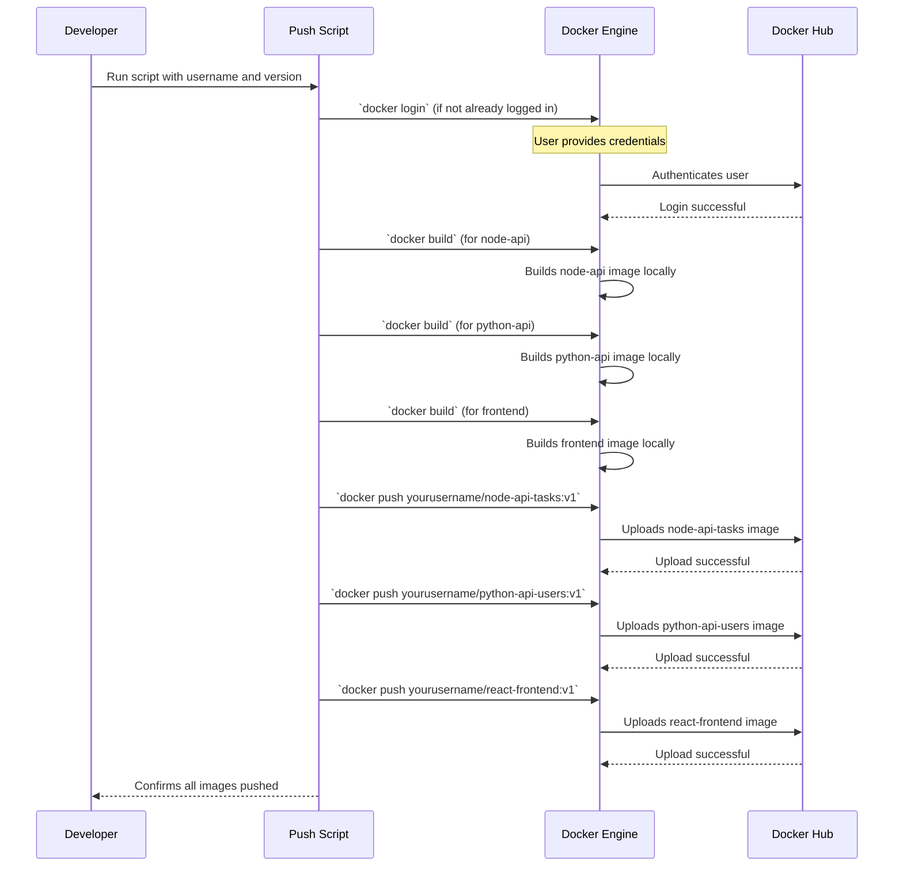

# Chapter 9: Docker Hub Deployment Automation


In our journey through the **AppDocker** project, we've successfully crafted all the individual pieces of our application: the interactive [React Frontend Application](01_react_frontend_application_.md), the specialized [NodeJS Tasks API](02_nodejs_tasks_api_.md), the insightful [Python Users & Dashboard API](03_python_users___dashboard_api_.md), and the central [MySQL Database](04_mysql_database_.md). In [Chapter 6: Docker Containerization](06_docker_containerization_.md), we learned to package each into its own container, and in [Chapter 7: Docker Compose Orchestration](07_docker_compose_orchestration_.md), we learned how to make them all run together, connecting them with [Nginx Reverse Proxy](08_nginx_reverse_proxy_.md).

At this point, you have a complete, robust, and containerized application running locally. But what if you want to share your application's components with others, deploy them to a cloud server, or integrate them into an automated deployment process? Manually building and copying Docker images every time would be a tedious and error-prone task.

### What Problem Does Docker Hub Deployment Automation Solve?

Imagine you're a baker who has perfected several unique cakes (our Docker images). You've successfully baked them in your kitchen (your local machine). Now, you want to sell them in a large online marketplace (like Docker Hub) so that customers (other developers, deployment servers) can easily find, download, and use your cakes without needing to know your exact recipe or baking process.

If you had to manually upload each cake, give it a name, a version, and make sure it's placed in the right section of the marketplace every single time you bake a new batch, it would take forever!

**Docker Hub Deployment Automation** solves this challenge by providing a set of scripts that streamline and automate the entire process of:
1.  **Building** fresh Docker images for each service (our application components).
2.  **Tagging** these images with clear names and versions.
3.  **Publishing** ("pushing") these images to Docker Hub, a public registry where you can store and share your Docker images.

This automation makes it super easy to create and update versions of your application components and share them reliably for deployment, ensuring that anyone who needs to use your application can get the correct, up-to-date versions of its parts effortlessly.

### Key Concepts

Let's break down the core ideas behind automatically deploying to Docker Hub:

#### 1. Docker Hub: The Online Image Store

**Docker Hub** is like GitHub, but instead of storing code, it's a vast online library where you can store and share your Docker images. You can think of it as a central marketplace or repository for Docker images.
*   **Public Images**: Many official images (like `node:20`, `python:3.11`, `mysql:8`, `nginx:alpine`) are available here for anyone to use.
*   **Your Images**: You can create an account and push your own custom images (like our `node-api`, `python-api`, `frontend`) to your personal repositories on Docker Hub.

#### 2. Image Tagging: Giving Your Images Versions

When you build a Docker image, it's important to give it a meaningful name and version, known as a **tag**. This helps you keep track of different versions of your application.
*   **Example**: `myusername/node-api-tasks:v1`
    *   `myusername`: Your Docker Hub username.
    *   `node-api-tasks`: The name of your image (e.g., the NodeJS API for tasks).
    *   `v1`: The **tag** or version number. You could also use `latest` for the most recent version.

#### 3. Deployment Automation Scripts: Your Robotic Assistant

These are simple command-line scripts (like `.sh` for Linux/WSL or `.ps1` for PowerShell on Windows) that bundle together a series of Docker commands. Instead of typing each command manually, you run one script, and it does all the repetitive work for you.
*   **Tasks**: Login to Docker Hub, build images, tag them, and push them.

### How to Automate Deployment to Docker Hub

In our **AppDocker** project, we've prepared scripts that do exactly this. You'll find them in the `Lab7/scripts/` folder:
*   `push-to-hub.sh`: For Linux or WSL environments.
*   `push-to-hub.ps1`: For Windows PowerShell.

Let's walk through how to use these scripts to push your custom application images to Docker Hub.

#### Step 1: Login to Docker Hub

Before you can push any images, you need to tell Docker who you are. This is like logging into an online store before you can upload products.

Open your terminal (Bash for `.sh`, PowerShell for `.ps1`) in the `Lab7` directory and run:

```bash
docker login
```
*   **Output**: Docker will prompt you for your Docker Hub username and password. Enter them correctly.
*   **Explanation**: This command securely authenticates your Docker client with Docker Hub, allowing you to push images to your repositories.

#### Step 2: Run the Automation Script

Now, let's use the script. You need to provide your Docker Hub username and, optionally, a version tag for your images.

**For Linux / WSL (using `push-to-hub.sh`):**

First, make the script executable:
```bash
chmod +x scripts/push-to-hub.sh
```

Then, run it, replacing `yourusername` with your actual Docker Hub username and `v1` with your desired version:
```bash
./scripts/push-to-hub.sh yourusername v1
```

**For Windows (using `push-to-hub.ps1` in PowerShell):**

Run the script, replacing `yourusername` with your actual Docker Hub username and `v1` with your desired version:
```powershell
.\scripts\push-to-hub.ps1 -Username yourusername -Version v1
```
*   **Input**: The script takes your Docker Hub username and an optional version. If you omit the version, it will default to `latest`.
*   **Output**: You'll see messages in your terminal indicating that each image is being built, tagged, and then pushed. If successful, it will list all the images pushed to your Docker Hub profile.
*   **Explanation**: This single command triggers the entire automated process: building all three of our application images, tagging them with your username and the specified version, and then uploading each one to your Docker Hub account.

After the script finishes, you can visit `https://hub.docker.com/u/yourusername` (replace `yourusername` with yours) in your web browser to see your newly pushed images!

### Under the Hood: What the Script Does

Let's look at a simplified sequence of actions when you run the `push-to-hub.sh` script.



#### Core Script Commands (from `scripts/push-to-hub.sh`)

Let's examine the essential commands inside the `push-to-hub.sh` script:

1.  **Login to Docker Hub**:

    ```bash
    # Prompts user for Docker Hub credentials
    docker login
    ```
    *   **Explanation**: This command initiates the login process. It's usually done once, but the script includes it to ensure authentication is always fresh.

2.  **Build and Tag Images**: For each of our services, the script runs a `docker build` command.

    ```bash
    # Build node-api
    docker build -t ${USERNAME}/node-api-tasks:${VERSION} ./node-api

    # Build python-api
    docker build -t ${USERNAME}/python-api-users:${VERSION} ./python-api

    # Build frontend
    docker build -t ${USERNAME}/react-frontend:${VERSION} ./frontend
    ```
    *   **`docker build`**: This command reads the `Dockerfile` in the specified directory (`./node-api`, `./python-api`, `./frontend`) and creates a Docker image.
    *   **`-t`**: This flag is for "tag." It gives the image a name in the format `yourusername/repository-name:tag`. This name is crucial for Docker Hub to know where to store the image and what to call it.
    *   **`${USERNAME}` and `${VERSION}`**: These are variables from the script that get replaced with the username and version you provided when running the script.

3.  **Push Images to Docker Hub**: After building and tagging, the images are uploaded.

    ```bash
    # Push node-api-tasks
    docker push ${USERNAME}/node-api-tasks:${VERSION}

    # Push python-api-users
    docker push ${USERNAME}/python-api-users:${VERSION}

    # Push react-frontend
    docker push ${USERNAME}/react-frontend:${VERSION}
    ```
    *   **`docker push`**: This command takes the locally built and tagged image and uploads it to the corresponding repository on Docker Hub. Docker Hub uses the `yourusername/repository-name:tag` to place the image correctly.

### Conclusion

In this final chapter, we mastered **Docker Hub Deployment Automation**. You learned that Docker Hub is an essential online registry for sharing your Docker images, and how to effectively version your images using tags. Most importantly, you saw how simple automation scripts can combine `docker login`, `docker build`, and `docker push` commands to automatically build, tag, and publish all your application's Docker images to Docker Hub with a single, easy-to-use command. This capability is fundamental for modern software development, enabling seamless sharing, continuous integration, and automated deployments of your containerized applications.

Congratulations! You've successfully built, containerized, orchestrated, and automated the deployment of a complete microservices application with **AppDocker**.

---

<sub><sup>Generated by [AI Codebase Knowledge Builder](https://github.com/The-Pocket/Tutorial-Codebase-Knowledge).</sup></sub> <sub><sup>**References**: [[1]](https://github.com/gianglt-dau/AppDocker/blob/42380997d078588130a5c047568a8b9cc06fb0c5/Lab6/README.md), [[2]](https://github.com/gianglt-dau/AppDocker/blob/42380997d078588130a5c047568a8b9cc06fb0c5/Lab7/README.md), [[3]](https://github.com/gianglt-dau/AppDocker/blob/42380997d078588130a5c047568a8b9cc06fb0c5/Lab7/scripts/build-only.ps1), [[4]](https://github.com/gianglt-dau/AppDocker/blob/42380997d078588130a5c047568a8b9cc06fb0c5/Lab7/scripts/build-only.sh), [[5]](https://github.com/gianglt-dau/AppDocker/blob/42380997d078588130a5c047568a8b9cc06fb0c5/Lab7/scripts/push-to-hub.ps1), [[6]](https://github.com/gianglt-dau/AppDocker/blob/42380997d078588130a5c047568a8b9cc06fb0c5/Lab7/scripts/push-to-hub.sh), [[7]](https://github.com/gianglt-dau/AppDocker/blob/42380997d078588130a5c047568a8b9cc06fb0c5/Notes.md)</sup></sub>