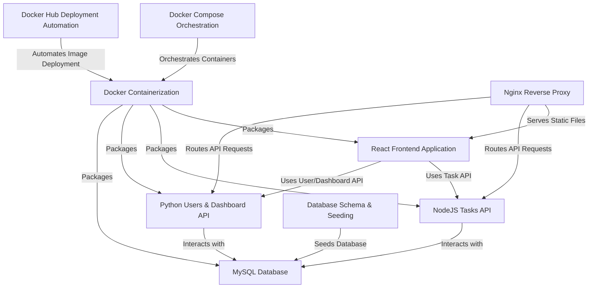

# Tutorial: AppDocker

This project is a **Task Manager application** built using a *microservices architecture*. It features a user-friendly **React frontend** for interaction, a **NodeJS API** specifically for managing tasks, and a separate **Python API** for user management and analytical dashboards. All application data is stored persistently in a **MySQL database**. The entire system is efficiently packaged into *Docker containers*, orchestrated for easy deployment and management using *Docker Compose*, and exposed via an **Nginx reverse proxy**. Additionally, scripts are provided to **automate building and pushing Docker images to Docker Hub**, streamlining the deployment process.

## Visual Overview

## Chapters

1. [React Frontend Application
   ](01_react_frontend_application_.md)
2. [NodeJS Tasks API
   ](02_nodejs_tasks_api_.md)
3. [Python Users &amp; Dashboard API
   ](03_python_users___dashboard_api_.md)
4. [MySQL Database
   ](04_mysql_database_.md)
5. [Database Schema &amp; Seeding
   ](05_database_schema___seeding_.md)
6. [Docker Containerization
   ](06_docker_containerization_.md)
7. [Docker Compose Orchestration
   ](07_docker_compose_orchestration_.md)
8. [Nginx Reverse Proxy
   ](08_nginx_reverse_proxy_.md)
9. [Docker Hub Deployment Automation
   ](09_docker_hub_deployment_automation_.md)

---

``Generated by [AI Codebase Knowledge Builder](https://github.com/The-Pocket/Tutorial-Codebase-Knowledge).``
